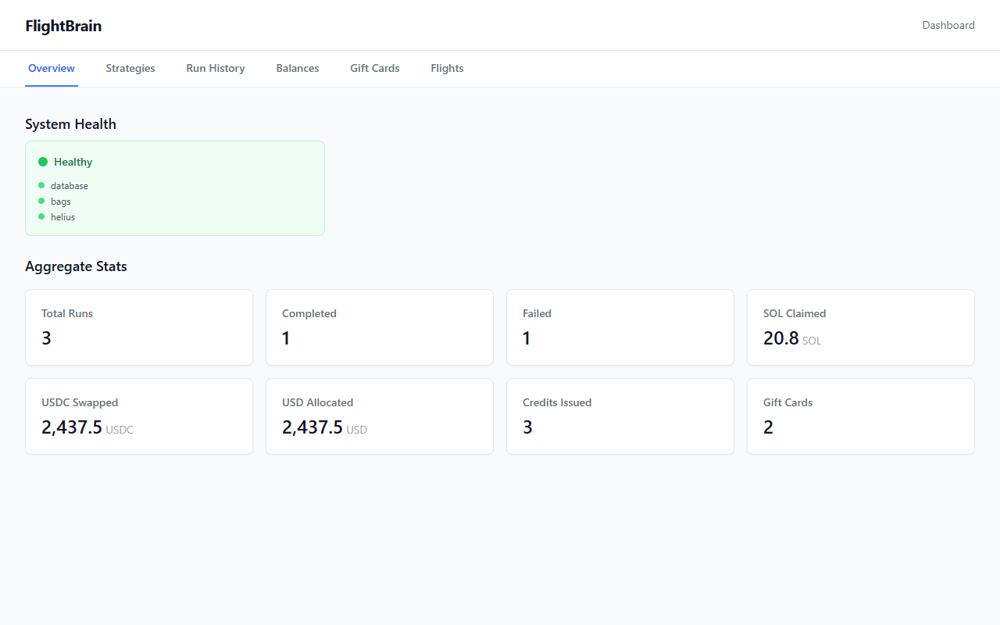
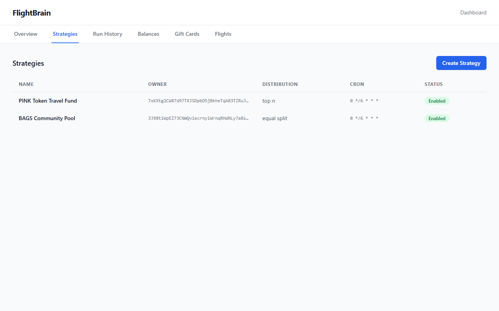
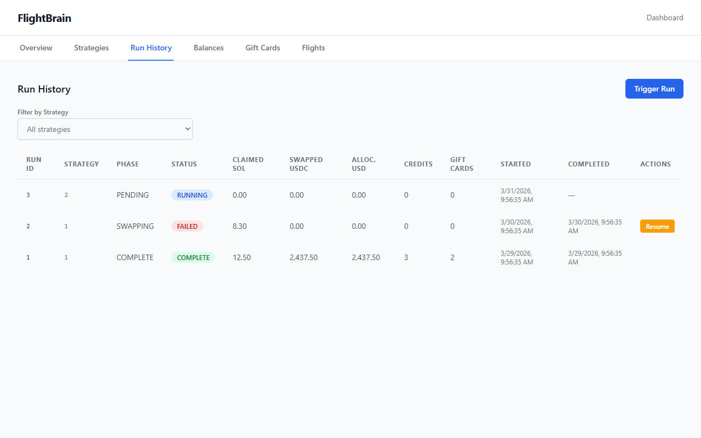
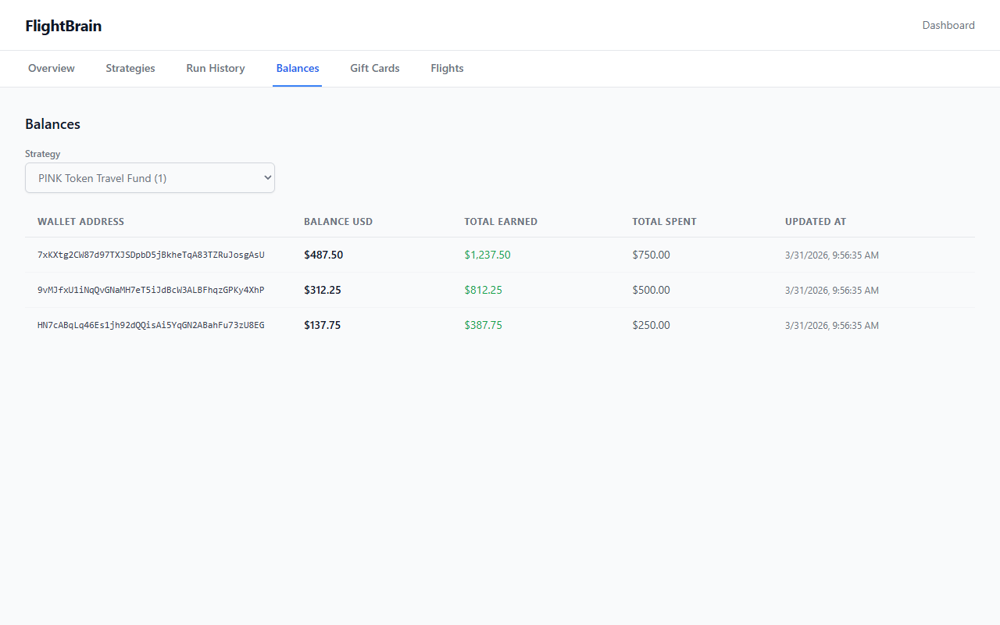
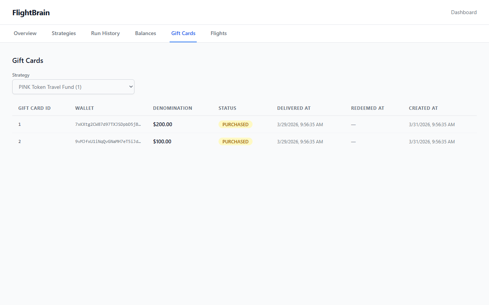
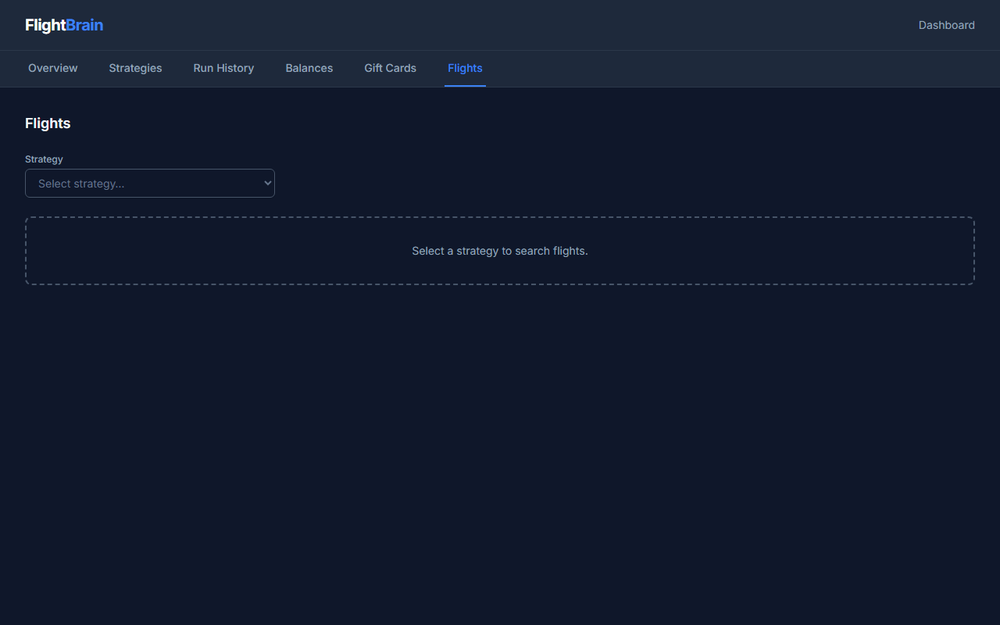

# FlightBrain — Bags.fm App Store Listing

## App Name

FlightBrain

## Tagline

Turn DeFi fees into flights.

## Category

DeFi / Travel

## Description

FlightBrain automates the conversion of Bags.fm trading fees into real-world travel. An automated 5-phase pipeline claims accrued SOL fees from Meteora vaults, swaps to USDC via the Bags trade API, distributes across token holders, and purchases travel credits or books flights directly — no out-of-pocket spending required.

Built for the Bags.fm App Store, kr8tiv TravelSwap bridges DeFi yield and real-world utility. Token holders earn travel credits proportional to their holdings, which can be redeemed for gift cards or used to search and book flights from 300+ airlines through the Duffel API. The entire pipeline is checkpointed — if a run fails mid-process, it resumes from where it left off.

FlightBrain is designed for token creators and DAOs who want to offer their communities tangible benefits from DeFi activity. Configure a strategy, set distribution rules, and let the pipeline run on a schedule — holders see travel credits appear in their balances automatically.

## Key Features

### Implemented

- **5-Phase Automated Pipeline** — Claim → Swap → Allocate → Credit → Complete, fully checkpointed with resume-from-failure support
- **Multiple Distribution Modes** — Owner-only, top-N holders, equal split, or weighted distribution across token holders
- **Flight Search & Booking** — Search 300+ airlines via Duffel API and book flights using travel balance
- **Travel Gift Cards** — Automatic purchase of TravelSwap gift cards at $50/$100/$200 thresholds
- **6-Tab Dashboard** — Real-time monitoring of strategies, runs, balances, gift cards, and flight bookings
- **Pipeline Safety Controls** — Dry-run mode, kill switch, daily run caps, per-run SOL limits
- **Resilience Architecture** — Circuit breakers + retry with exponential backoff on all external API clients
- **Health Monitoring** — Liveness and readiness probes with circuit breaker state reporting
- **RESTful API** — 21 endpoints covering strategies, runs, balances, credits, flights, and bookings
- **Docker Deployment** — Multi-stage Docker build with PostgreSQL 16 via docker-compose

### Planned (Future Roadmap)

- Scheduled pipeline execution via cron
- Helius DAS integration for on-chain holder snapshots
- Multi-token portfolio strategies
- Hotel and experience bookings
- Mobile-responsive dashboard

## Technical Highlights

| Aspect | Detail |
|--------|--------|
| **Runtime** | Node.js 22, TypeScript 5, Fastify |
| **Frontend** | React 19, Vite, Tailwind CSS, TanStack React Query |
| **Database** | SQLite (development) / PostgreSQL 16 (production) |
| **Blockchain** | Solana, Bags SDK, Helius RPC |
| **Travel APIs** | Duffel (flights), CoinVoyage/TravelSwap (gift cards) |
| **Resilience** | Circuit breakers (CLOSED → OPEN → HALF_OPEN), retry with backoff |
| **Testing** | 616 tests across 35 test files (Vitest) |
| **Deployment** | Docker multi-stage build, docker-compose |
| **Observability** | Pino structured logging, health endpoints, circuit breaker state |

## Screenshots

Dashboard screenshots captured from the FlightBrain monitoring interface:

| # | Screenshot | Tab | Description |
|---|-----------|-----|-------------|
| 1 |  | Overview | Aggregate pipeline statistics, active strategy count, and system health |
| 2 |  | Strategies | Strategy management with distribution mode, token mint, and owner wallet |
| 3 |  | Run History | Pipeline run history with phase-level checkpoint data and status |
| 4 |  | Balances | Per-wallet travel balance tracking by strategy |
| 5 |  | Gift Cards | Gift card purchase records with denomination and status |
| 6 |  | Flights | Flight search interface with origin, destination, date, and cabin class |

## Links

| Resource | URL |
|----------|-----|
| GitHub Repository | [github.com/kr8tiv-ai/kr8tiv-Travelswap-on-Bags-App](https://github.com/kr8tiv-ai/kr8tiv-Travelswap-on-Bags-App) |
| Documentation | See [README.md](../README.md) |
| TravelSwap Platform | [travelswap.xyz](https://travelswap.xyz) |
| Duffel API | [duffel.com/docs](https://duffel.com/docs) |
| Bags.fm Platform | [bags.fm](https://bags.fm) |

## kr8tiv Ecosystem

kr8tiv TravelSwap on Bags is part of the kr8tiv suite of Bags.fm App Store applications. Each app converts trading fees into a different form of real-world utility:

| App | What It Does | Output |
|-----|-------------|--------|
| **kr8tiv TravelSwap** (this app) | Fees → Travel credits + flight bookings | Flights, hotels, travel |

The platform demonstrates automated DeFi fee reinvestment into tangible value, built on the Bags.fm App Store infrastructure.

## Hackathon Submission Notes

### What's Implemented

- Complete 5-phase pipeline engine with checkpointing and resume
- All 21 REST API endpoints with Zod validation and Bearer auth
- 6-tab React dashboard with real-time data fetching
- Flight search and booking via Duffel API integration
- Gift card purchasing via CoinVoyage/TravelSwap SDK
- Resilience layer: circuit breakers + retry with backoff on all external clients
- Health endpoints with circuit breaker state reporting
- Docker deployment with PostgreSQL 16
- 616 automated tests covering units, integration, and E2E flows

### What Requires External Dependencies

- **Bags API Key** — Required for claiming fees from Bags.fm vaults
- **Helius API Key** — Required for Solana RPC and token holder lookups
- **Duffel API Token** — Required for live flight search and booking (sandbox available)
- **Signer Private Key** — Required for signing on-chain transactions

### Future Work

- Scheduled execution (cron-based pipeline triggers)
- Helius DAS integration for on-chain token holder resolution
- Multi-strategy portfolios
- Expanded travel inventory (hotels, experiences)
- Mobile-optimized dashboard
